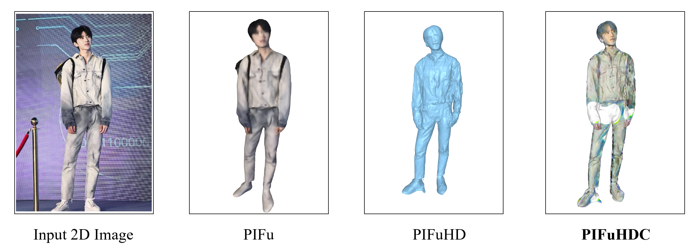
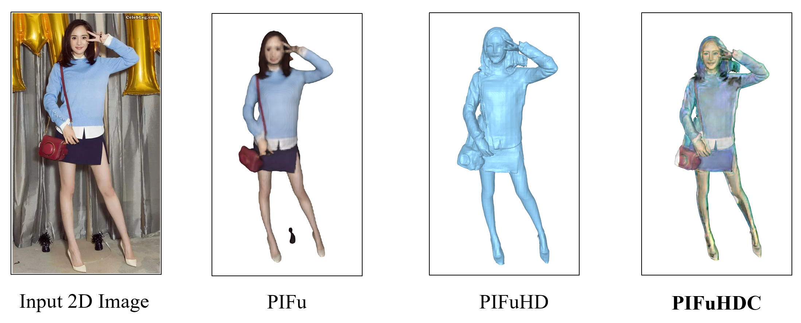

# [PIFuHDC: Multi-Level Pixel-Aligned Implicit Function for High-Resolution 3D Human Digitization with Colorization](https://github.com/xiahongchi/PIFuHDC)

## Introduction

Although algorithms based on PIFu has already been able to reconstruct 3D human shape through constructing and learning a neural network representing a pixel-aligned implicit function and are usually memory-efficient, PIFu can only reconstruct the low-resolution shape and color texture of human and PIFuHD can only reconstruct the high-resolution of human shape. 

This repo introduces a brand new reconstruction algorithm called Pixel-Aligned Implicit Function for High-Resolution 3D Human Digitization with Colorization (PIFuHDC), aiming to reconstruct both high-resolution human shape and color texture. 

PIFuHDC not only blends the advantages of PIFu and PIFuHD, but also employs the ability of reconstructing high-resolution human shape inherited from PIFuHD and introduces a brand new pixel-aligned implicit function to reconstruct the high-resolution RGB color texture, which is easy to train and adjust, and PIFuHDC can well perform the task of reconstructing high-resolution 3D human shape with high-resolution color texture.


## Effects






## Requirements

- Python 3
- [PyTorch](https://pytorch.org/) tested on 1.4.0, 1.5.0
- json
- PIL
- skimage
- tqdm
- cv2

For visualization
- [trimesh](https://trimsh.org/) with pyembree
- PyOpenGL
- freeglut (use `sudo apt-get install freeglut3-dev` for ubuntu users)
- ffmpeg

Note: At least 8GB GPU memory is recommended to run PIFuHD model. 

Run the following code to install all pip packages:
```sh
pip install -r requirements.txt 
```


## Download Pre-trained model

Run the following script to download the pretrained model. The checkpoint is saved under `./checkpoints/`.
```
sh ./scripts/download_trained_model.sh
```


## Testing

1. run the following script to get joints for each image for testing (joints are used for image cropping only.). Make sure you correctly set the location of OpenPose binary. 
```
python apps/batch_openpose.py -d {openpose_root_path} -i {path_of_images} -o {path_of_images}
```

2. run the following script to run reconstruction code. Make sure to set `--input_path` to `path_of_images`, `--out_path` to where you want to dump out results, `--ckpt_path` to the PIFuHD checkpoint and `--ckpt_path_Color ` to the PIFuHDC net_C_HD.pt checkpoint.
```
python -m apps.test_colorHD.py
```

3. optionally, you can also remove artifacts by keeping only the biggest connected component from the mesh reconstruction with the following script. (Warning: the script will overwrite the original obj files.)
```
python apps/clean_mesh.py -f {path_of_objs}
```

## Visualization
To render results with turn-table, run the following code. The rendered animation (.mp4) will be stored under `{path_of_objs}`.
```
python -m apps.render_turntable -f {path_of_objs} -ww {rendering_width} -hh {rendering_height} 
# add -g for geometry rendering. default is normal visualization.
```

## Training
For training the PIFuHDC network, you can check the file `scripts/train_color.sh`. Make sure to set `--dataroot` to the path of renderpeople dataset and you may need to refer to [PIFu repo](https://github.com/shunsukesaito/PIFu) and for the step of Data Generation, you need to set the image size to 1024 for HD images generation. `--load_netMR_checkpoint_path` to where the PIFuHD checkpoint locates at and `--load_netC_checkpoint_path` to where the raw PIFuHDC net_C_HD.pt checkpoint locates at.

